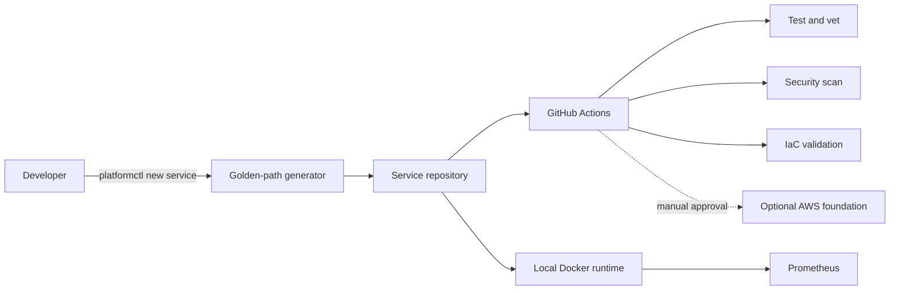

# Architecture

## System context

## Control plane

`platformctl` is the developer-facing control plane. It validates input and creates a service from an owned, versioned template. The template is intentionally inspectable: developers can see and change every generated file.

## Workload plane

Generated services receive:

- a standard HTTP contract (`/healthz`, `/readyz`, and `/metrics`)
- structured application logs
- a non-root, minimal runtime image
- ownership metadata compatible with Backstage catalogs
- a test entrypoint and local run instructions

## Delivery plane

Pull requests run deterministic quality gates. AWS changes are plan-only in automation; apply remains manual so a fork or unreviewed change cannot create billable resources.

## Observability plane

Prometheus discovers the demo workload through the local Compose network. A production version would use managed metrics or an OpenTelemetry collector and route alerts to an owned destination.

## Key tradeoffs

| Decision | Benefit | Tradeoff |
| --- | --- | --- |
| Go CLI with no third-party dependencies | Fast, portable, auditable | Smaller initial command surface |
| Docker Compose before Kubernetes | Free and approachable | Does not demonstrate cluster operations yet |
| Backstage-compatible metadata without Backstage runtime | Preserves the catalog path with low local overhead | No portal UI in phase 1 |
| Manual cloud apply | Prevents surprise spend | Slower than continuous deployment |
| Public subnet / NAT-free future design | Avoids a common fixed AWS cost | Requires careful service exposure choices |

## Rollback

- Generator releases are versioned; teams can pin a known template version.
- Application rollback means redeploying the previous immutable image digest.
- Infrastructure rollback is a reviewed OpenTofu change, not an automatic `destroy`.
- Local rollback is `docker compose down` followed by checkout of the previous commit.
