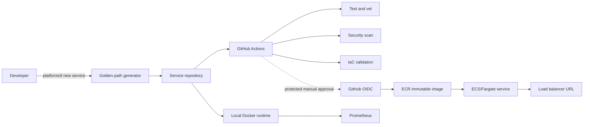

# Architecture

## System context

## Control plane

`platformctl` is the developer-facing control plane. It validates input and creates a service from an owned, versioned template. The template is intentionally inspectable: developers can see and change every generated file.

## Workload plane

Generated services receive:

- a standard HTTP contract (`/healthz`, `/readyz`, and `/metrics`)
- structured application logs
- a non-root, minimal runtime image
- ownership metadata compatible with Backstage catalogs
- a test entrypoint and local run instructions

## Delivery plane

Pull requests run deterministic quality gates without AWS credentials. A separate `workflow_dispatch` workflow can deploy, roll back, or destroy only through the protected `portfolio-aws` GitHub environment. OIDC exchanges a repository- and environment-scoped GitHub token for short-lived AWS credentials, so no AWS access keys are stored in GitHub.

Deployment of the included `hello-api` reference workload is intentionally two-stage. The workflow first creates the budget, registry, logs, and ECS cluster while the service switch remains off. It then builds an image already covered by the pull-request scan, tags it with the Git commit SHA, pushes that immutable artifact, plans the workload, and enables the service. The ECS deployment circuit breaker rolls back failed task launches, and an HTTP smoke test verifies `/healthz` before publishing the URL. Generated services would consume this delivery capability through a future reusable workflow or repository-registration command.

## Observability plane

Prometheus discovers the demo workload through the free local Compose network. The optional cloud path sends structured container logs to a seven-day CloudWatch log group. Container Insights remains separately disabled because it is billable. A production version would add OpenTelemetry, alerts, HTTPS, and an owned domain.

## Key tradeoffs

| Decision | Benefit | Tradeoff |
| --- | --- | --- |
| Go CLI with no third-party dependencies | Fast, portable, auditable | Smaller initial command surface |
| Docker Compose before Kubernetes | Free and approachable | Does not demonstrate cluster operations yet |
| Backstage-compatible metadata without Backstage runtime | Preserves the catalog path with low local overhead | No portal UI in phase 1 |
| Protected manual cloud workflow | Makes promotion, rollback, and cleanup repeatable while retaining human approval | Requires GitHub environment configuration |
| OIDC instead of stored AWS keys | Short-lived, repository-scoped credentials | Requires a one-time trust bootstrap |
| ECS/Fargate behind an ALB | Demonstrates a realistic container delivery contract and stable URL | Costs money whenever applied |
| Public subnets without a NAT Gateway | Allows ECR/log access while avoiding a large fixed NAT charge | Tasks receive billable public IPv4 addresses |
| Two deployment switches | Foundation and workload spending require separate explicit decisions | Adds workflow complexity |

## Rollback

- Generator releases are versioned; teams can pin a known template version.
- Application rollback means selecting a previous immutable Git-SHA image tag in the manual workflow.
- ECS automatically rolls back a deployment that fails its health checks through its deployment circuit breaker.
- Infrastructure rollback is a reviewed OpenTofu change, not an automatic `destroy`.
- Local rollback is `docker compose down` followed by checkout of the previous commit.
